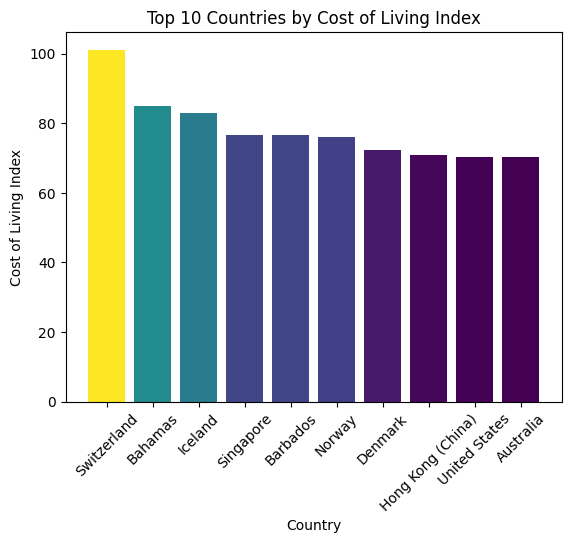
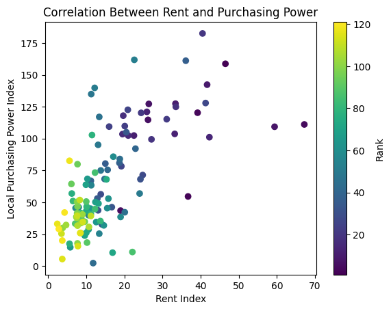

# Project: Cost of Living Index by Country

## Import Libraries, Data and Perform Exploratory Analysis


```python
# Import Libraries
import pandas as pd
```


```python
# Load Dataset
data = pd.read_csv('Cost_of_Living_Index_by_Country_2024.csv')
```


```python
# Exploratory Analysis
data
```


<div>
<style scoped>
    .dataframe tbody tr th:only-of-type {
        vertical-align: middle;
    }

    .dataframe tbody tr th {
        vertical-align: top;
    }

    .dataframe thead th {
        text-align: right;
    }
</style>
<table border="1" class="dataframe">
  <thead>
    <tr style="text-align: right;">
      <th></th>
      <th>Rank</th>
      <th>Country</th>
      <th>Cost of Living Index</th>
      <th>Rent Index</th>
      <th>Cost of Living Plus Rent Index</th>
      <th>Groceries Index</th>
      <th>Restaurant Price Index</th>
      <th>Local Purchasing Power Index</th>
    </tr>
  </thead>
  <tbody>
    <tr>
      <th>0</th>
      <td>1</td>
      <td>Switzerland</td>
      <td>101.1</td>
      <td>46.5</td>
      <td>74.9</td>
      <td>109.1</td>
      <td>97.0</td>
      <td>158.7</td>
    </tr>
    <tr>
      <th>1</th>
      <td>2</td>
      <td>Bahamas</td>
      <td>85.0</td>
      <td>36.7</td>
      <td>61.8</td>
      <td>81.6</td>
      <td>83.3</td>
      <td>54.6</td>
    </tr>
    <tr>
      <th>2</th>
      <td>3</td>
      <td>Iceland</td>
      <td>83.0</td>
      <td>39.2</td>
      <td>62.0</td>
      <td>88.4</td>
      <td>86.8</td>
      <td>120.3</td>
    </tr>
    <tr>
      <th>3</th>
      <td>4</td>
      <td>Singapore</td>
      <td>76.7</td>
      <td>67.2</td>
      <td>72.1</td>
      <td>74.6</td>
      <td>50.4</td>
      <td>111.1</td>
    </tr>
    <tr>
      <th>4</th>
      <td>5</td>
      <td>Barbados</td>
      <td>76.6</td>
      <td>19.0</td>
      <td>48.9</td>
      <td>80.8</td>
      <td>69.4</td>
      <td>43.5</td>
    </tr>
    <tr>
      <th>...</th>
      <td>...</td>
      <td>...</td>
      <td>...</td>
      <td>...</td>
      <td>...</td>
      <td>...</td>
      <td>...</td>
      <td>...</td>
    </tr>
    <tr>
      <th>116</th>
      <td>117</td>
      <td>Bangladesh</td>
      <td>22.5</td>
      <td>2.4</td>
      <td>12.8</td>
      <td>25.7</td>
      <td>12.8</td>
      <td>33.1</td>
    </tr>
    <tr>
      <th>117</th>
      <td>118</td>
      <td>India</td>
      <td>21.2</td>
      <td>5.6</td>
      <td>13.7</td>
      <td>23.8</td>
      <td>15.1</td>
      <td>82.6</td>
    </tr>
    <tr>
      <th>118</th>
      <td>119</td>
      <td>Egypt</td>
      <td>21.0</td>
      <td>3.7</td>
      <td>12.7</td>
      <td>21.2</td>
      <td>16.2</td>
      <td>20.0</td>
    </tr>
    <tr>
      <th>119</th>
      <td>120</td>
      <td>Libya</td>
      <td>20.4</td>
      <td>4.3</td>
      <td>12.7</td>
      <td>22.2</td>
      <td>15.2</td>
      <td>42.0</td>
    </tr>
    <tr>
      <th>120</th>
      <td>121</td>
      <td>Pakistan</td>
      <td>18.8</td>
      <td>2.8</td>
      <td>11.1</td>
      <td>17.5</td>
      <td>12.9</td>
      <td>29.1</td>
    </tr>
  </tbody>
</table>
<p>121 rows × 8 columns</p>
</div>


```python
data.shape
```


    (121, 8)


```python
data.columns
```


    Index(['Rank', 'Country', 'Cost of Living Index', 'Rent Index',
           'Cost of Living Plus Rent Index', 'Groceries Index',
           'Restaurant Price Index', 'Local Purchasing Power Index'],
          dtype='object')


```python
data.info()
```

    <class 'pandas.core.frame.DataFrame'>
    RangeIndex: 121 entries, 0 to 120
    Data columns (total 8 columns):
     #   Column                          Non-Null Count  Dtype  
    ---  ------                          --------------  -----  
     0   Rank                            121 non-null    int64  
     1   Country                         121 non-null    object 
     2   Cost of Living Index            121 non-null    float64
     3   Rent Index                      121 non-null    float64
     4   Cost of Living Plus Rent Index  121 non-null    float64
     5   Groceries Index                 121 non-null    float64
     6   Restaurant Price Index          121 non-null    float64
     7   Local Purchasing Power Index    121 non-null    float64
    dtypes: float64(6), int64(1), object(1)
    memory usage: 7.7+ KB
    

## Answer Questions! 


```python
# Question 1: What countries have the Most and Least expensive cost of living including rent compared to New York?
cost = data[['Rank', 'Country', 'Cost of Living Plus Rent Index']]
```


```python
cost.head()
```


<div>
<style scoped>
    .dataframe tbody tr th:only-of-type {
        vertical-align: middle;
    }

    .dataframe tbody tr th {
        vertical-align: top;
    }

    .dataframe thead th {
        text-align: right;
    }
</style>
<table border="1" class="dataframe">
  <thead>
    <tr style="text-align: right;">
      <th></th>
      <th>Rank</th>
      <th>Country</th>
      <th>Cost of Living Plus Rent Index</th>
    </tr>
  </thead>
  <tbody>
    <tr>
      <th>0</th>
      <td>1</td>
      <td>Switzerland</td>
      <td>74.9</td>
    </tr>
    <tr>
      <th>1</th>
      <td>2</td>
      <td>Bahamas</td>
      <td>61.8</td>
    </tr>
    <tr>
      <th>2</th>
      <td>3</td>
      <td>Iceland</td>
      <td>62.0</td>
    </tr>
    <tr>
      <th>3</th>
      <td>4</td>
      <td>Singapore</td>
      <td>72.1</td>
    </tr>
    <tr>
      <th>4</th>
      <td>5</td>
      <td>Barbados</td>
      <td>48.9</td>
    </tr>
  </tbody>
</table>
</div>


```python
# Most Expensive
expensive = cost.sort_values(by = 'Cost of Living Plus Rent Index', ascending = False)[:1]
```


<div>
<style scoped>
    .dataframe tbody tr th:only-of-type {
        vertical-align: middle;
    }

    .dataframe tbody tr th {
        vertical-align: top;
    }

    .dataframe thead th {
        text-align: right;
    }
</style>
<table border="1" class="dataframe">
  <thead>
    <tr style="text-align: right;">
      <th></th>
      <th>Rank</th>
      <th>Country</th>
      <th>Cost of Living Plus Rent Index</th>
    </tr>
  </thead>
  <tbody>
    <tr>
      <th>0</th>
      <td>1</td>
      <td>Switzerland</td>
      <td>74.9</td>
    </tr>
  </tbody>
</table>
</div>


```python
# Least Expensive
cheap = cost.sort_values(by = 'Cost of Living Plus Rent Index')[:1]
cheap
```


<div>
<style scoped>
    .dataframe tbody tr th:only-of-type {
        vertical-align: middle;
    }

    .dataframe tbody tr th {
        vertical-align: top;
    }

    .dataframe thead th {
        text-align: right;
    }
</style>
<table border="1" class="dataframe">
  <thead>
    <tr style="text-align: right;">
      <th></th>
      <th>Rank</th>
      <th>Country</th>
      <th>Cost of Living Plus Rent Index</th>
    </tr>
  </thead>
  <tbody>
    <tr>
      <th>120</th>
      <td>121</td>
      <td>Pakistan</td>
      <td>11.1</td>
    </tr>
  </tbody>
</table>
</div>


```python
# Question 2: How does the United Arab Emirates (Dubai) index’s compare to New York?
data[(data['Country'] == 'United Arab Emirates') | (data['Country'] == 'United States')]
```


<div>
<style scoped>
    .dataframe tbody tr th:only-of-type {
        vertical-align: middle;
    }

    .dataframe tbody tr th {
        vertical-align: top;
    }

    .dataframe thead th {
        text-align: right;
    }
</style>
<table border="1" class="dataframe">
  <thead>
    <tr style="text-align: right;">
      <th></th>
      <th>Rank</th>
      <th>Country</th>
      <th>Cost of Living Index</th>
      <th>Rent Index</th>
      <th>Cost of Living Plus Rent Index</th>
      <th>Groceries Index</th>
      <th>Restaurant Price Index</th>
      <th>Local Purchasing Power Index</th>
    </tr>
  </thead>
  <tbody>
    <tr>
      <th>8</th>
      <td>9</td>
      <td>United States</td>
      <td>70.4</td>
      <td>41.7</td>
      <td>56.6</td>
      <td>75.0</td>
      <td>67.2</td>
      <td>142.3</td>
    </tr>
    <tr>
      <th>26</th>
      <td>27</td>
      <td>United Arab Emirates</td>
      <td>55.8</td>
      <td>41.3</td>
      <td>48.9</td>
      <td>45.3</td>
      <td>49.2</td>
      <td>127.9</td>
    </tr>
  </tbody>
</table>
</div>


```python
# Question 3: How much cheaper is it to rent and buy groceries in the Bahamas compared to NY?
data[data['Country'].isin(['Bahamas'])]
# Using loc
# data.loc[data['Country'] == 'Bahamas']
```


<div>
<style scoped>
    .dataframe tbody tr th:only-of-type {
        vertical-align: middle;
    }

    .dataframe tbody tr th {
        vertical-align: top;
    }

    .dataframe thead th {
        text-align: right;
    }
</style>
<table border="1" class="dataframe">
  <thead>
    <tr style="text-align: right;">
      <th></th>
      <th>Rank</th>
      <th>Country</th>
      <th>Cost of Living Index</th>
      <th>Rent Index</th>
      <th>Cost of Living Plus Rent Index</th>
      <th>Groceries Index</th>
      <th>Restaurant Price Index</th>
      <th>Local Purchasing Power Index</th>
    </tr>
  </thead>
  <tbody>
    <tr>
      <th>1</th>
      <td>2</td>
      <td>Bahamas</td>
      <td>85.0</td>
      <td>36.7</td>
      <td>61.8</td>
      <td>81.6</td>
      <td>83.3</td>
      <td>54.6</td>
    </tr>
  </tbody>
</table>
</div>


```python
print(f'It is 63.3% cheaper to rent in the Bahamas and 19.4% cheaper to buy groceries.')
```


```python
# Question 4: On average how much more expensive is it to buy groceries in NY compared to India?
groceries = data[['Groceries Index', 'Country']]
```


```python
groceries[groceries['Country'] == 'India']
```


<div>
<style scoped>
    .dataframe tbody tr th:only-of-type {
        vertical-align: middle;
    }

    .dataframe tbody tr th {
        vertical-align: top;
    }

    .dataframe thead th {
        text-align: right;
    }
</style>
<table border="1" class="dataframe">
  <thead>
    <tr style="text-align: right;">
      <th></th>
      <th>Groceries Index</th>
      <th>Country</th>
    </tr>
  </thead>
  <tbody>
    <tr>
      <th>117</th>
      <td>23.8</td>
      <td>India</td>
    </tr>
  </tbody>
</table>
</div>


```python
print(f'With an average salary, it is 76.2% less expensive to buy groceries in India compared to NY')
```

    It is 76.2% less expensive to buy groceries in India compared to NY
    

## Visualizations!


```python
# 1. Create a visualization of the top 10 countries with the highest cost of living
import seaborn as sns
import matplotlib.pyplot as plt
import matplotlib.colors as mcolors
```


```python
top_10 = data[['Country', 'Cost of Living Index']].sort_values(by = 'Cost of Living Index', ascending = False)[:10]
```


```python
top_10
```


<div>
<style scoped>
    .dataframe tbody tr th:only-of-type {
        vertical-align: middle;
    }

    .dataframe tbody tr th {
        vertical-align: top;
    }

    .dataframe thead th {
        text-align: right;
    }
</style>
<table border="1" class="dataframe">
  <thead>
    <tr style="text-align: right;">
      <th></th>
      <th>Country</th>
      <th>Cost of Living Index</th>
    </tr>
  </thead>
  <tbody>
    <tr>
      <th>0</th>
      <td>Switzerland</td>
      <td>101.1</td>
    </tr>
    <tr>
      <th>1</th>
      <td>Bahamas</td>
      <td>85.0</td>
    </tr>
    <tr>
      <th>2</th>
      <td>Iceland</td>
      <td>83.0</td>
    </tr>
    <tr>
      <th>3</th>
      <td>Singapore</td>
      <td>76.7</td>
    </tr>
    <tr>
      <th>4</th>
      <td>Barbados</td>
      <td>76.6</td>
    </tr>
    <tr>
      <th>5</th>
      <td>Norway</td>
      <td>76.0</td>
    </tr>
    <tr>
      <th>6</th>
      <td>Denmark</td>
      <td>72.3</td>
    </tr>
    <tr>
      <th>7</th>
      <td>Hong Kong (China)</td>
      <td>70.8</td>
    </tr>
    <tr>
      <th>8</th>
      <td>United States</td>
      <td>70.4</td>
    </tr>
    <tr>
      <th>9</th>
      <td>Australia</td>
      <td>70.2</td>
    </tr>
  </tbody>
</table>
</div>


```python
# Define a colormap
cmap = plt.get_cmap('viridis')

# Normalize 
norm = plt.Normalize(min(top_10['Cost of Living Index']), max(top_10['Cost of Living Index']))

# Create the bar chart, color based on 'Cost of Living Index' norm. 
bars = plt.bar(top_10['Country'], top_10['Cost of Living Index'], color = cmap(norm(top_10['Cost of Living Index'])))

# Labels and title
plt.xlabel('Country')
plt.ylabel('Cost of Living Index')
plt.title('Top 10 Countries by Cost of Living Index')
plt.xticks(rotation=45)
plt.show()
```


    

    


```python
# 2: Create a scatterplot to see if there is a correlation between rent and the amount of purchasing power one has
corr = data[['Rent Index', 'Local Purchasing Power Index', 'Rank', 'Country']]
corr
```


<div>
<style scoped>
    .dataframe tbody tr th:only-of-type {
        vertical-align: middle;
    }

    .dataframe tbody tr th {
        vertical-align: top;
    }

    .dataframe thead th {
        text-align: right;
    }
</style>
<table border="1" class="dataframe">
  <thead>
    <tr style="text-align: right;">
      <th></th>
      <th>Rent Index</th>
      <th>Local Purchasing Power Index</th>
      <th>Rank</th>
      <th>Country</th>
    </tr>
  </thead>
  <tbody>
    <tr>
      <th>0</th>
      <td>46.5</td>
      <td>158.7</td>
      <td>1</td>
      <td>Switzerland</td>
    </tr>
    <tr>
      <th>1</th>
      <td>36.7</td>
      <td>54.6</td>
      <td>2</td>
      <td>Bahamas</td>
    </tr>
    <tr>
      <th>2</th>
      <td>39.2</td>
      <td>120.3</td>
      <td>3</td>
      <td>Iceland</td>
    </tr>
    <tr>
      <th>3</th>
      <td>67.2</td>
      <td>111.1</td>
      <td>4</td>
      <td>Singapore</td>
    </tr>
    <tr>
      <th>4</th>
      <td>19.0</td>
      <td>43.5</td>
      <td>5</td>
      <td>Barbados</td>
    </tr>
    <tr>
      <th>...</th>
      <td>...</td>
      <td>...</td>
      <td>...</td>
      <td>...</td>
    </tr>
    <tr>
      <th>116</th>
      <td>2.4</td>
      <td>33.1</td>
      <td>117</td>
      <td>Bangladesh</td>
    </tr>
    <tr>
      <th>117</th>
      <td>5.6</td>
      <td>82.6</td>
      <td>118</td>
      <td>India</td>
    </tr>
    <tr>
      <th>118</th>
      <td>3.7</td>
      <td>20.0</td>
      <td>119</td>
      <td>Egypt</td>
    </tr>
    <tr>
      <th>119</th>
      <td>4.3</td>
      <td>42.0</td>
      <td>120</td>
      <td>Libya</td>
    </tr>
    <tr>
      <th>120</th>
      <td>2.8</td>
      <td>29.1</td>
      <td>121</td>
      <td>Pakistan</td>
    </tr>
  </tbody>
</table>
<p>121 rows × 4 columns</p>
</div>


```python
# Matplotlib Scatter Plot
plt.scatter(corr['Rent Index'], corr['Local Purchasing Power Index'], c=corr['Rank'], cmap = 'viridis')
plt.colorbar(label = 'Rank')
plt.xlabel('Rent Index')
plt.ylabel('Local Purchasing Power Index')
plt.title('Correlation Between Rent and Purchasing Power')
```


    Text(0.5, 1.0, 'Correlation Between Rent and Purchasing Power')


    

    


```python

```
